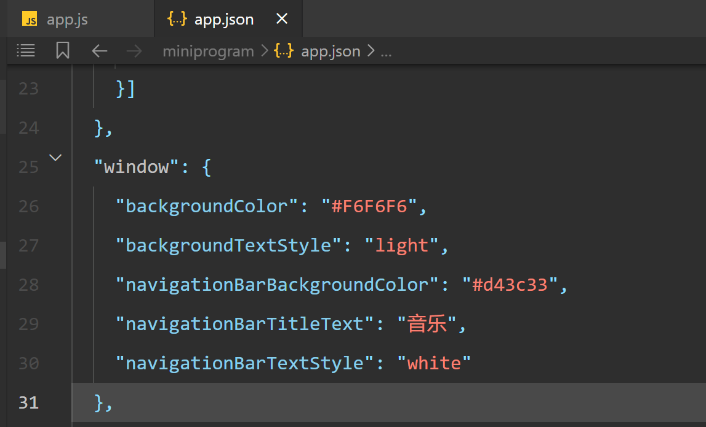

# 一 代码规范

- 定义变量，使用const 和 let

- 定义对象时，把略写的属性放前，详写的属性放后。例如：

  ```js
  let username = 'zhangsan'
  let obj = {
      username,
      age:13
  }
  ```

- 使用箭头函数

- 参考`airbnb`代码规范

  

# 二 页面结构

1. 有三个页面：app.json的`pages`

   

2. 小程序标题和样式：app.json的`window`对象

   

3. 页面底部导航栏：

   

   

# 三 音乐页面

## 1）轮播图：小程序自带组件

`wx:key`：可以是对象里的某个属性，例如`url`，也可以是`wx:key='*this'`

```wxml
<swiper class="swiper" indicator-dots="true" autoplay="true" interval="2000" duration="1000">
  <block wx:for="{{swiperImgUrls}}" wx:key="url">
    <swiper-item>
      <image class="img" src="{{item.fileid}}" mode="widthFix"></image>
    </swiper-item>
  </block>
</swiper>
```

将 `wx:for` 用在`<block/>`标签上，以渲染一个包含多节点的结构块。

## 2）唱片区域

1. 自定义组件：

   

2. 页面添加自定义组件：

   - 在pages/playlist/playlist.json添加：

     ```json
     {
      "usingComponents": {
         "x-playlist": "/components/playlist/playlist" 
       },
     }
     ```

   - 嵌套`x-playlist`：在pages/playlist/playlist.wxml

     ```wxml
     <x-playlist></x-playlist>
     ```

3. 父组件传递数据给子组件

   父组件：

   ```wxml
   <block wx:for="{{playlist}}" wx:key="_id">
       <x-playlist playlist="{{item}}"></x-playlist>
     </block>
   ```

   子组件：js文件接收：

   ```js
   Component({
     properties: {
       playlist:{
         type:Object
       }
     },
   })
   ```

   子组件：wxml文件显示

   ```wxml
   <view class="playlist-container">
     <image src="{{playlist.picUrl}}" class="playlist-img"></image>
     <text class="playlist-playcount">{{_count}}</text>
     <view class="playlist-name">{{playlist.name}}</view>
   </view>
   ```

4. 文字最多展示2行，超过的使用省略号代替。

   ```wxss
   .playlist-name{
     font-size: 26rpx;
     line-height: 1.2;
     padding: 2px 0 0 6px;
     display: -webkit-box;
     -webkit-box-orient: vertical;
     -webkit-line-clamp: 2;
     overflow: hidden;
     text-overflow: ellipsis;
   }
   ```

5. 唱片数量格式化：数字太大，使用亿/万为单位

   监听器获取唱片数量：
   
   ```js
   properties: {
       playlist:{
         type:Object
       }
     },
   
     observers:{
       "playlist.playCount"(val){
         this.setData({
           _count:this._tranNumber(val, 2)
         })
       }
     },
   ```
   
   使用单位：
   
   ```js
       _tranNumber(num,point){
         let numStr = num.toString().split('.')[0];
         if(numStr.length < 6){
           return numStr
         }else if(numStr.length >= 6 && numStr.length <= 8) {
           let decimal = numStr.substring(numStr.length - 4, numStr.length - 4 + point)
           return parseFloat(parseInt(num/10000) + '.' + decimal) + '万'
         }else if(numStr.length > 8){
           let decimal = numStr.substring(numStr.length - 8, numStr.length - 8 + point)
           return parseFloat(parseInt(num/100000000) + '.' + decimal) + '亿'
         }
       }
   ```

## 3）promise

1. promise解决回调地狱问题

   ```js
    setTimeout(() => {
         console.log(1)
         setTimeout(() => {
           console.log(2)
           setTimeout(() => {
             console.log(3)
           }, 3000)
         }, 2000)
       }, 1000) 
   ```

   使用promise写法：

   ```js
    new Promise((resolve, reject) => {
         setTimeout(()=>{
           console.log(1)
           resolve()
         }, 1000)
       }).then((res)=>{
         setTimeout(()=>{
           console.log(2)
         }, 2000)
       }) 
   ```

2. `Promise.all`：`所有promise执行完毕`后再执行对应事件。

   ```js
         Promise.all([p1, p2, p3]).then((res) => {
          console.log('全部完成')
          console.log(res)
        }).catch((err) => {
          console.log('失败')
          console.log(err)
        }) 
   ```

   如果有一个promise执行失败，也不会影响后续的promise执行，但是会执行`Promise.all([p1, p2, p3]).catch`的事件

3. `Promise.race`：任意一个promise执行完成，即执行`Promise.race().then`的事件。且`[p1, p2, p3]`其他promise依旧会执行。

   ```js
        Promise.race([p1, p2, p3]).then((res) => {
         console.log('完成')
         console.log(res)
       }).catch((err) => {
         console.log('失败')
         console.log(err)
       }) 
   ```

4. `async await`：小程序端不支持该语法。

   注意：**当前小程序编译已支持async await语法**

   如何解决上述问题：utils/runtime.js。在使用`async和await`的文件里引入`utils/runtime.js`

   ```js
    import regeneratorRuntime from '../../utils/runtime.js'
   ```

   ```js
   /**
    * Copyright (c) 2014-present, Facebook, Inc.
    *
    * This source code is licensed under the MIT license found in the
    * LICENSE file in the root directory of this source tree.
    */
   
   !(function(global) {
       // "use strict";
     
       var Op = Object.prototype;
       var hasOwn = Op.hasOwnProperty;
       var undefined; // More compressible than void 0.
       var $Symbol = typeof Symbol === "function" ? Symbol : {};
       var iteratorSymbol = $Symbol.iterator || "@@iterator";
       var asyncIteratorSymbol = $Symbol.asyncIterator || "@@asyncIterator";
       var toStringTagSymbol = $Symbol.toStringTag || "@@toStringTag";
     
       var inModule = typeof module === "object";
       var runtime = global.regeneratorRuntime;
       if (runtime) {
         if (inModule) {
           // If regeneratorRuntime is defined globally and we're in a module,
           // make the exports object identical to regeneratorRuntime.
           module.exports = runtime;
         }
         // Don't bother evaluating the rest of this file if the runtime was
         // already defined globally.
         return;
       }
     
       // Define the runtime globally (as expected by generated code) as either
       // module.exports (if we're in a module) or a new, empty object.
       runtime = global.regeneratorRuntime = inModule ? module.exports : {};
     
       function wrap(innerFn, outerFn, self, tryLocsList) {
         // If outerFn provided and outerFn.prototype is a Generator, then outerFn.prototype instanceof Generator.
         var protoGenerator = outerFn && outerFn.prototype instanceof Generator ? outerFn : Generator;
         var generator = Object.create(protoGenerator.prototype);
         var context = new Context(tryLocsList || []);
     
         // The ._invoke method unifies the implementations of the .next,
         // .throw, and .return methods.
         generator._invoke = makeInvokeMethod(innerFn, self, context);
     
         return generator;
       }
       runtime.wrap = wrap;
     
       // Try/catch helper to minimize deoptimizations. Returns a completion
       // record like context.tryEntries[i].completion. This interface could
       // have been (and was previously) designed to take a closure to be
       // invoked without arguments, but in all the cases we care about we
       // already have an existing method we want to call, so there's no need
       // to create a new function object. We can even get away with assuming
       // the method takes exactly one argument, since that happens to be true
       // in every case, so we don't have to touch the arguments object. The
       // only additional allocation required is the completion record, which
       // has a stable shape and so hopefully should be cheap to allocate.
       function tryCatch(fn, obj, arg) {
         try {
           return { type: "normal", arg: fn.call(obj, arg) };
         } catch (err) {
           return { type: "throw", arg: err };
         }
       }
     
       var GenStateSuspendedStart = "suspendedStart";
       var GenStateSuspendedYield = "suspendedYield";
       var GenStateExecuting = "executing";
       var GenStateCompleted = "completed";
     
       // Returning this object from the innerFn has the same effect as
       // breaking out of the dispatch switch statement.
       var ContinueSentinel = {};
     
       // Dummy constructor functions that we use as the .constructor and
       // .constructor.prototype properties for functions that return Generator
       // objects. For full spec compliance, you may wish to configure your
       // minifier not to mangle the names of these two functions.
       function Generator() {}
       function GeneratorFunction() {}
       function GeneratorFunctionPrototype() {}
     
       // This is a polyfill for %IteratorPrototype% for environments that
       // don't natively support it.
       var IteratorPrototype = {};
       IteratorPrototype[iteratorSymbol] = function () {
         return this;
       };
     
       var getProto = Object.getPrototypeOf;
       var NativeIteratorPrototype = getProto && getProto(getProto(values([])));
       if (NativeIteratorPrototype &&
           NativeIteratorPrototype !== Op &&
           hasOwn.call(NativeIteratorPrototype, iteratorSymbol)) {
         // This environment has a native %IteratorPrototype%; use it instead
         // of the polyfill.
         IteratorPrototype = NativeIteratorPrototype;
       }
     
       var Gp = GeneratorFunctionPrototype.prototype =
         Generator.prototype = Object.create(IteratorPrototype);
       GeneratorFunction.prototype = Gp.constructor = GeneratorFunctionPrototype;
       GeneratorFunctionPrototype.constructor = GeneratorFunction;
       GeneratorFunctionPrototype[toStringTagSymbol] =
         GeneratorFunction.displayName = "GeneratorFunction";
     
       // Helper for defining the .next, .throw, and .return methods of the
       // Iterator interface in terms of a single ._invoke method.
       function defineIteratorMethods(prototype) {
         ["next", "throw", "return"].forEach(function(method) {
           prototype[method] = function(arg) {
             return this._invoke(method, arg);
           };
         });
       }
     
       runtime.isGeneratorFunction = function(genFun) {
         var ctor = typeof genFun === "function" && genFun.constructor;
         return ctor
           ? ctor === GeneratorFunction ||
             // For the native GeneratorFunction constructor, the best we can
             // do is to check its .name property.
             (ctor.displayName || ctor.name) === "GeneratorFunction"
           : false;
       };
     
       runtime.mark = function(genFun) {
         if (Object.setPrototypeOf) {
           Object.setPrototypeOf(genFun, GeneratorFunctionPrototype);
         } else {
           genFun.__proto__ = GeneratorFunctionPrototype;
           if (!(toStringTagSymbol in genFun)) {
             genFun[toStringTagSymbol] = "GeneratorFunction";
           }
         }
         genFun.prototype = Object.create(Gp);
         return genFun;
       };
     
       // Within the body of any async function, `await x` is transformed to
       // `yield regeneratorRuntime.awrap(x)`, so that the runtime can test
       // `hasOwn.call(value, "__await")` to determine if the yielded value is
       // meant to be awaited.
       runtime.awrap = function(arg) {
         return { __await: arg };
       };
     
       function AsyncIterator(generator) {
         function invoke(method, arg, resolve, reject) {
           var record = tryCatch(generator[method], generator, arg);
           if (record.type === "throw") {
             reject(record.arg);
           } else {
             var result = record.arg;
             var value = result.value;
             if (value &&
                 typeof value === "object" &&
                 hasOwn.call(value, "__await")) {
               return Promise.resolve(value.__await).then(function(value) {
                 invoke("next", value, resolve, reject);
               }, function(err) {
                 invoke("throw", err, resolve, reject);
               });
             }
     
             return Promise.resolve(value).then(function(unwrapped) {
               // When a yielded Promise is resolved, its final value becomes
               // the .value of the Promise<{value,done}> result for the
               // current iteration.
               result.value = unwrapped;
               resolve(result);
             }, function(error) {
               // If a rejected Promise was yielded, throw the rejection back
               // into the async generator function so it can be handled there.
               return invoke("throw", error, resolve, reject);
             });
           }
         }
     
         var previousPromise;
     
         function enqueue(method, arg) {
           function callInvokeWithMethodAndArg() {
             return new Promise(function(resolve, reject) {
               invoke(method, arg, resolve, reject);
             });
           }
     
           return previousPromise =
             // If enqueue has been called before, then we want to wait until
             // all previous Promises have been resolved before calling invoke,
             // so that results are always delivered in the correct order. If
             // enqueue has not been called before, then it is important to
             // call invoke immediately, without waiting on a callback to fire,
             // so that the async generator function has the opportunity to do
             // any necessary setup in a predictable way. This predictability
             // is why the Promise constructor synchronously invokes its
             // executor callback, and why async functions synchronously
             // execute code before the first await. Since we implement simple
             // async functions in terms of async generators, it is especially
             // important to get this right, even though it requires care.
             previousPromise ? previousPromise.then(
               callInvokeWithMethodAndArg,
               // Avoid propagating failures to Promises returned by later
               // invocations of the iterator.
               callInvokeWithMethodAndArg
             ) : callInvokeWithMethodAndArg();
         }
     
         // Define the unified helper method that is used to implement .next,
         // .throw, and .return (see defineIteratorMethods).
         this._invoke = enqueue;
       }
     
       defineIteratorMethods(AsyncIterator.prototype);
       AsyncIterator.prototype[asyncIteratorSymbol] = function () {
         return this;
       };
       runtime.AsyncIterator = AsyncIterator;
     
       // Note that simple async functions are implemented on top of
       // AsyncIterator objects; they just return a Promise for the value of
       // the final result produced by the iterator.
       runtime.async = function(innerFn, outerFn, self, tryLocsList) {
         var iter = new AsyncIterator(
           wrap(innerFn, outerFn, self, tryLocsList)
         );
     
         return runtime.isGeneratorFunction(outerFn)
           ? iter // If outerFn is a generator, return the full iterator.
           : iter.next().then(function(result) {
               return result.done ? result.value : iter.next();
             });
       };
     
       function makeInvokeMethod(innerFn, self, context) {
         var state = GenStateSuspendedStart;
     
         return function invoke(method, arg) {
           if (state === GenStateExecuting) {
             throw new Error("Generator is already running");
           }
     
           if (state === GenStateCompleted) {
             if (method === "throw") {
               throw arg;
             }
     
             // Be forgiving, per 25.3.3.3.3 of the spec:
             // https://people.mozilla.org/~jorendorff/es6-draft.html#sec-generatorresume
             return doneResult();
           }
     
           context.method = method;
           context.arg = arg;
     
           while (true) {
             var delegate = context.delegate;
             if (delegate) {
               var delegateResult = maybeInvokeDelegate(delegate, context);
               if (delegateResult) {
                 if (delegateResult === ContinueSentinel) continue;
                 return delegateResult;
               }
             }
     
             if (context.method === "next") {
               // Setting context._sent for legacy support of Babel's
               // function.sent implementation.
               context.sent = context._sent = context.arg;
     
             } else if (context.method === "throw") {
               if (state === GenStateSuspendedStart) {
                 state = GenStateCompleted;
                 throw context.arg;
               }
     
               context.dispatchException(context.arg);
     
             } else if (context.method === "return") {
               context.abrupt("return", context.arg);
             }
     
             state = GenStateExecuting;
     
             var record = tryCatch(innerFn, self, context);
             if (record.type === "normal") {
               // If an exception is thrown from innerFn, we leave state ===
               // GenStateExecuting and loop back for another invocation.
               state = context.done
                 ? GenStateCompleted
                 : GenStateSuspendedYield;
     
               if (record.arg === ContinueSentinel) {
                 continue;
               }
     
               return {
                 value: record.arg,
                 done: context.done
               };
     
             } else if (record.type === "throw") {
               state = GenStateCompleted;
               // Dispatch the exception by looping back around to the
               // context.dispatchException(context.arg) call above.
               context.method = "throw";
               context.arg = record.arg;
             }
           }
         };
       }
     
       // Call delegate.iterator[context.method](context.arg) and handle the
       // result, either by returning a { value, done } result from the
       // delegate iterator, or by modifying context.method and context.arg,
       // setting context.delegate to null, and returning the ContinueSentinel.
       function maybeInvokeDelegate(delegate, context) {
         var method = delegate.iterator[context.method];
         if (method === undefined) {
           // A .throw or .return when the delegate iterator has no .throw
           // method always terminates the yield* loop.
           context.delegate = null;
     
           if (context.method === "throw") {
             if (delegate.iterator.return) {
               // If the delegate iterator has a return method, give it a
               // chance to clean up.
               context.method = "return";
               context.arg = undefined;
               maybeInvokeDelegate(delegate, context);
     
               if (context.method === "throw") {
                 // If maybeInvokeDelegate(context) changed context.method from
                 // "return" to "throw", let that override the TypeError below.
                 return ContinueSentinel;
               }
             }
     
             context.method = "throw";
             context.arg = new TypeError(
               "The iterator does not provide a 'throw' method");
           }
     
           return ContinueSentinel;
         }
     
         var record = tryCatch(method, delegate.iterator, context.arg);
     
         if (record.type === "throw") {
           context.method = "throw";
           context.arg = record.arg;
           context.delegate = null;
           return ContinueSentinel;
         }
     
         var info = record.arg;
     
         if (! info) {
           context.method = "throw";
           context.arg = new TypeError("iterator result is not an object");
           context.delegate = null;
           return ContinueSentinel;
         }
     
         if (info.done) {
           // Assign the result of the finished delegate to the temporary
           // variable specified by delegate.resultName (see delegateYield).
           context[delegate.resultName] = info.value;
     
           // Resume execution at the desired location (see delegateYield).
           context.next = delegate.nextLoc;
     
           // If context.method was "throw" but the delegate handled the
           // exception, let the outer generator proceed normally. If
           // context.method was "next", forget context.arg since it has been
           // "consumed" by the delegate iterator. If context.method was
           // "return", allow the original .return call to continue in the
           // outer generator.
           if (context.method !== "return") {
             context.method = "next";
             context.arg = undefined;
           }
     
         } else {
           // Re-yield the result returned by the delegate method.
           return info;
         }
     
         // The delegate iterator is finished, so forget it and continue with
         // the outer generator.
         context.delegate = null;
         return ContinueSentinel;
       }
     
       // Define Generator.prototype.{next,throw,return} in terms of the
       // unified ._invoke helper method.
       defineIteratorMethods(Gp);
     
       Gp[toStringTagSymbol] = "Generator";
     
       // A Generator should always return itself as the iterator object when the
       // @@iterator function is called on it. Some browsers' implementations of the
       // iterator prototype chain incorrectly implement this, causing the Generator
       // object to not be returned from this call. This ensures that doesn't happen.
       // See https://github.com/facebook/regenerator/issues/274 for more details.
       Gp[iteratorSymbol] = function() {
         return this;
       };
     
       Gp.toString = function() {
         return "[object Generator]";
       };
     
       function pushTryEntry(locs) {
         var entry = { tryLoc: locs[0] };
     
         if (1 in locs) {
           entry.catchLoc = locs[1];
         }
     
         if (2 in locs) {
           entry.finallyLoc = locs[2];
           entry.afterLoc = locs[3];
         }
     
         this.tryEntries.push(entry);
       }
     
       function resetTryEntry(entry) {
         var record = entry.completion || {};
         record.type = "normal";
         delete record.arg;
         entry.completion = record;
       }
     
       function Context(tryLocsList) {
         // The root entry object (effectively a try statement without a catch
         // or a finally block) gives us a place to store values thrown from
         // locations where there is no enclosing try statement.
         this.tryEntries = [{ tryLoc: "root" }];
         tryLocsList.forEach(pushTryEntry, this);
         this.reset(true);
       }
     
       runtime.keys = function(object) {
         var keys = [];
         for (var key in object) {
           keys.push(key);
         }
         keys.reverse();
     
         // Rather than returning an object with a next method, we keep
         // things simple and return the next function itself.
         return function next() {
           while (keys.length) {
             var key = keys.pop();
             if (key in object) {
               next.value = key;
               next.done = false;
               return next;
             }
           }
     
           // To avoid creating an additional object, we just hang the .value
           // and .done properties off the next function object itself. This
           // also ensures that the minifier will not anonymize the function.
           next.done = true;
           return next;
         };
       };
     
       function values(iterable) {
         if (iterable) {
           var iteratorMethod = iterable[iteratorSymbol];
           if (iteratorMethod) {
             return iteratorMethod.call(iterable);
           }
     
           if (typeof iterable.next === "function") {
             return iterable;
           }
     
           if (!isNaN(iterable.length)) {
             var i = -1, next = function next() {
               while (++i < iterable.length) {
                 if (hasOwn.call(iterable, i)) {
                   next.value = iterable[i];
                   next.done = false;
                   return next;
                 }
               }
     
               next.value = undefined;
               next.done = true;
     
               return next;
             };
     
             return next.next = next;
           }
         }
     
         // Return an iterator with no values.
         return { next: doneResult };
       }
       runtime.values = values;
     
       function doneResult() {
         return { value: undefined, done: true };
       }
     
       Context.prototype = {
         constructor: Context,
     
         reset: function(skipTempReset) {
           this.prev = 0;
           this.next = 0;
           // Resetting context._sent for legacy support of Babel's
           // function.sent implementation.
           this.sent = this._sent = undefined;
           this.done = false;
           this.delegate = null;
     
           this.method = "next";
           this.arg = undefined;
     
           this.tryEntries.forEach(resetTryEntry);
     
           if (!skipTempReset) {
             for (var name in this) {
               // Not sure about the optimal order of these conditions:
               if (name.charAt(0) === "t" &&
                   hasOwn.call(this, name) &&
                   !isNaN(+name.slice(1))) {
                 this[name] = undefined;
               }
             }
           }
         },
     
         stop: function() {
           this.done = true;
     
           var rootEntry = this.tryEntries[0];
           var rootRecord = rootEntry.completion;
           if (rootRecord.type === "throw") {
             throw rootRecord.arg;
           }
     
           return this.rval;
         },
     
         dispatchException: function(exception) {
           if (this.done) {
             throw exception;
           }
     
           var context = this;
           function handle(loc, caught) {
             record.type = "throw";
             record.arg = exception;
             context.next = loc;
     
             if (caught) {
               // If the dispatched exception was caught by a catch block,
               // then let that catch block handle the exception normally.
               context.method = "next";
               context.arg = undefined;
             }
     
             return !! caught;
           }
     
           for (var i = this.tryEntries.length - 1; i >= 0; --i) {
             var entry = this.tryEntries[i];
             var record = entry.completion;
     
             if (entry.tryLoc === "root") {
               // Exception thrown outside of any try block that could handle
               // it, so set the completion value of the entire function to
               // throw the exception.
               return handle("end");
             }
     
             if (entry.tryLoc <= this.prev) {
               var hasCatch = hasOwn.call(entry, "catchLoc");
               var hasFinally = hasOwn.call(entry, "finallyLoc");
     
               if (hasCatch && hasFinally) {
                 if (this.prev < entry.catchLoc) {
                   return handle(entry.catchLoc, true);
                 } else if (this.prev < entry.finallyLoc) {
                   return handle(entry.finallyLoc);
                 }
     
               } else if (hasCatch) {
                 if (this.prev < entry.catchLoc) {
                   return handle(entry.catchLoc, true);
                 }
     
               } else if (hasFinally) {
                 if (this.prev < entry.finallyLoc) {
                   return handle(entry.finallyLoc);
                 }
     
               } else {
                 throw new Error("try statement without catch or finally");
               }
             }
           }
         },
     
         abrupt: function(type, arg) {
           for (var i = this.tryEntries.length - 1; i >= 0; --i) {
             var entry = this.tryEntries[i];
             if (entry.tryLoc <= this.prev &&
                 hasOwn.call(entry, "finallyLoc") &&
                 this.prev < entry.finallyLoc) {
               var finallyEntry = entry;
               break;
             }
           }
     
           if (finallyEntry &&
               (type === "break" ||
                type === "continue") &&
               finallyEntry.tryLoc <= arg &&
               arg <= finallyEntry.finallyLoc) {
             // Ignore the finally entry if control is not jumping to a
             // location outside the try/catch block.
             finallyEntry = null;
           }
     
           var record = finallyEntry ? finallyEntry.completion : {};
           record.type = type;
           record.arg = arg;
     
           if (finallyEntry) {
             this.method = "next";
             this.next = finallyEntry.finallyLoc;
             return ContinueSentinel;
           }
     
           return this.complete(record);
         },
     
         complete: function(record, afterLoc) {
           if (record.type === "throw") {
             throw record.arg;
           }
     
           if (record.type === "break" ||
               record.type === "continue") {
             this.next = record.arg;
           } else if (record.type === "return") {
             this.rval = this.arg = record.arg;
             this.method = "return";
             this.next = "end";
           } else if (record.type === "normal" && afterLoc) {
             this.next = afterLoc;
           }
     
           return ContinueSentinel;
         },
     
         finish: function(finallyLoc) {
           for (var i = this.tryEntries.length - 1; i >= 0; --i) {
             var entry = this.tryEntries[i];
             if (entry.finallyLoc === finallyLoc) {
               this.complete(entry.completion, entry.afterLoc);
               resetTryEntry(entry);
               return ContinueSentinel;
             }
           }
         },
     
         "catch": function(tryLoc) {
           for (var i = this.tryEntries.length - 1; i >= 0; --i) {
             var entry = this.tryEntries[i];
             if (entry.tryLoc === tryLoc) {
               var record = entry.completion;
               if (record.type === "throw") {
                 var thrown = record.arg;
                 resetTryEntry(entry);
               }
               return thrown;
             }
           }
     
           // The context.catch method must only be called with a location
           // argument that corresponds to a known catch block.
           throw new Error("illegal catch attempt");
         },
     
         delegateYield: function(iterable, resultName, nextLoc) {
           this.delegate = {
             iterator: values(iterable),
             resultName: resultName,
             nextLoc: nextLoc
           };
     
           if (this.method === "next") {
             // Deliberately forget the last sent value so that we don't
             // accidentally pass it on to the delegate.
             this.arg = undefined;
           }
     
           return ContinueSentinel;
         }
       };
     })(
       // In sloppy mode, unbound `this` refers to the global object, fallback to
       // Function constructor if we're in global strict mode. That is sadly a form
       // of indirect eval which violates Content Security Policy.
       (function() { return this })() || Function("return this")()
     );
     
   ```

## 4）读取歌单并插入云数据库

1. 思路：定时从服务器上读取歌单，把新读取的歌单与原歌单进行比较，如果是新的内容，则插入到云数据库里。

2. 创建云函数:

   - 鼠标右键——>新建云函数

     

   - 云函数安装依赖：在`getplaylist`右键打开终端

     

   - 在`index.js`文件里，完成云函数。再右键`上传部署：云端安装依赖`

     ```js
     // 云函数入口文件
     const cloud = require('wx-server-sdk')
     
     cloud.init({ env: cloud.DYNAMIC_CURRENT_ENV }) // 使用当前云环境
     
     const db = cloud.database()
     const axios = require('axios')
     const URL = 'https://apis.imooc.com/personalized?icode=836DEC452E8A792B'
     const playlistCollection = db.collection('playlist')
     // 云函数入口函数
     exports.main = async (event, context) => {
       const list = await playlistCollection.get();//获取云数据库的数据
       const {data} = await axios.get(URL)
       if(data.code >= 1000){
         console.log(data.msg)
         return 0;
       }
       const playlist = data.result;
       const newData = [];
       // 去重
       for(let i=0;i<playlist.length;i++){
         let flag = true;
         for(let j=0;j<list.length;j++){
           if(playlist[i].id == list[j].id){
             flag = false;
             break
           }
         }
         if(flag){
           newData.push(playlist[i])
         }
       }
       console.log(newData.length)
       //批量插入
       if(newData.length > 0){
         await playlistCollection.add({
           data:newData
         })
       }
       return newData.length
     }
     ```

   - 本地测试云函数："getplaylist"右键“开启云函数本地调试”

     出现以下bug：则终端安装：`cnpm i --save wx-server-sdk`

     

## 5）突破获取条数限制

1. 小程序获取云函数数据库，最多只能获取100条信息。

2. 获取云数据库的数据总条数，如果大于100条，则多次获取云数据数据。

   ```js
   const MAX_SIZE = 100
   ```

   ```js
     const countResult = await playlistCollection.count()
     const total = countResult.total
     const totalTimes = Math.ceil(total/MAX_SIZE)
     const tasks = [];
     for(let i=0;i<totalTimes;i++){
       const promise = await playlistCollection.skip(i*MAX_SIZE).limit(MAX_SIZE).get()
       tasks.push(promise)
     }
     let list = []
     if(tasks.length > 0){
       list = (await Promise.all(tasks)).reduce((acc,cur)=>{
         return acc.data.concat(cur.data)
       })
     }
   ```

3. 定时执行云函数：在getPlaylist/config.json添加：

   ```js
   {
       "triggers": [
       {
         "name": "myTrigger",
         "type": "timer",
         "config": "0 0 10,14,16,23 * * * *"
       }
     ],
   }
   ```

4. 调用云函数

   - music云函数

     ```js
     // 云函数入口文件
     const cloud = require('wx-server-sdk')
     
     cloud.init({ env: cloud.DYNAMIC_CURRENT_ENV }) // 使用当前云环境
     const db = cloud.database()
     const playlistCollection = db.collection('playlist')
     // 云函数入口函数
     exports.main = async (event, context) => {
       // 获取唱片：设置开始和结束位置，获取后再根据时间排序
       return await playlistCollection.skip(event.start)
         .limit(event.count)
         .orderBy('createTime','desc')
         .get()
         .then((res)=>{
           return res
         })
     }
     ```

   - 调用music云函数

## 6）云函数路由优化：tcb-router

1. tcb-router：基于 koa 风格的小程序·[云开发](https://so.csdn.net/so/search?q=云开发&spm=1001.2101.3001.7020)云函数轻量级类路由库，主要用于优化服务端函数处理逻辑
   基于tcb-router 一个云函数可以分很多路由来处理业务环境。

   

   

2. 云函数

   ```js
   // 云函数入口文件
   const cloud = require('wx-server-sdk')
   const TcbRouter = require('tcb-router'); //引用TcbRouter
   
   cloud.init()
   
   // 云函数入口函数
   exports.main = async (event, context) => {
     const app = new TcbRouter({ event})
   
   //定义公共路由
   // app.use 表示该中间件会适用于所有的路由
     app.use(async(ctx,next)=>{
       ctx.data={con:'我是公共数据'}
       ctx.data.openId=wxContent.openId
      await next()
   
   })
   
   app.router(['user,school'],async(ctx,next)=>{
     ctx.data.from='合并路由'
     await next()
   
   })
   
   app.router('user', async (ctx, next) => {
       ctx.data.name = 'music'
       ctx.data.role ='歌曲'
       await next()
     }, async(ctx)=>{
       ctx.data.age= '音乐'
       ctx.body={
       code:0,
       date:ctx.data
       }
     })
   
   
     app.router('school', async (ctx, next) => {
       ctx.data.name = '云学院'
       ctx.data.url = 'tencent.com'
       await next()
   
     }, async (ctx) => {
       ctx.data.nickName = '腾讯'
       ctx.body = { code: 0, date: ctx.data }
     })
   
   
     return app.serve();
   }
   
   ```

3. 小程序调用云函数

   ```js
   user(){
       wx.cloud.callFunction({
         // 要调用的云函数名称
         name: "tcbRouter",
         // 传递给云函数的参数
         data: {
           $url: "user", // 要调用的路由的路径，传入准确路径或者通配符*
           
         }
       }).then(res=>{
         console.log(res)
       })
     },
   
     school(){
       wx.cloud.callFunction({
         // 要调用的云函数名称
         name: "tcbRouter",
         // 传递给云函数的参数
         data: {
           $url: "school", // 要调用的路由的路径，传入准确路径或者通配符*
   
         }
       }).then(res => {
         console.log(res)
       })
     }
   
   ```

# 四 唱片的歌单列表

## 1）音乐页面跳转歌单列表页面

- `app.json`对象添加pages

  

- 唱片绑定跳转事件

  ```wxml
  bind:tap="goToMusiclist"
  ```

  ```js
  goToMusiclist(){
        wx.navigateTo({
          url: `../../pages/musiclist/musiclist?playlistId=${this.properties.playlist.id}`,
        })
      }
  ```

- 歌单列表页面触发云函数

  ```js
  onLoad(options) {
      wx.showLoading({
        title: '加载中',
      })
      //获取歌单
      wx.cloud.callFunction({
        name:'music',
        data:{
          playlistId:options.playlistId,
          $url:'musiclist'
        }
      }).then((res)=>{
        console.log(res)
        const pl = res.result.playlist
        this.setData({
          musiclist: pl.tracks,
          listInfo: {
            coverImgUrl: pl.coverImgUrl,
            name: pl.name,
          }
        })
        wx.hideLoading()
      })
  }
  ```

- 云函数获取歌单列表

  ```js
    //根据唱片id，获取歌单列表
    app.use('musiclist',async(ctx,next)=>{
      const res = 
        await axios.get(`${BASE_URL}/playlist/detail?id=${parseInt(event.playlistId)}&${imooc}`)
      ctx.body = res.data
    })
  ```

## 2）高亮显示播放音乐

1. 自定义属性

   

# 五 播放页面

## 1）播放点击歌曲

1. 把歌单列表和点击的index存储在url链接

   components/playlist

   ```js
   goToMusiclist(){
         wx.navigateTo({
           url: `../../pages/musiclist/musiclist?playlistId=${this.properties.playlist.id}`,
         })
       }
   ```

2. 点击唱片时，存储唱片歌曲

   pages/musiclist

   ```js
     //setStorageSync
     _setMusiclist(){
       wx.setStorageSync('musiclist',this.data.musiclist)
     }
   ```

3. 页面呈现：pages/player

4. js设置页面标题

   ```js
       wx.setNavigationBarTitle({
         title: music.name,
       })
   ```

5. 播放音乐：通过接口获取音乐播放地址

   ```js
   // 获取全局唯一的背景音频管理器 getBackgroundAudioManager
   const backgroundAudioManager = wx.getBackgroundAudioManager()
   Page({
       getAudioUrl(){
           wx.cloud.callFunction({
         name:'music',
         data:{
           musicId,
           $url:'musicUrl'
         }
       }).then((res)=>{
         let result = res.result
         backgroundAudioManager.src = result.data[0].url
         //音频标题，用于原生音频播放器音频标题（必填）
         backgroundAudioManager.title = music.name;//必须加，否则音频不会播放
         backgroundAudioManager.coverImgUrl = music.al.picUrl;
         backgroundAudioManager.singer = music.ar[0].name;
         backgroundAudioManager.epname = music.al.name
       })
       }
   })
   ```

   云函数

   music/index.js

   ```js
     //音乐地址
     app.use('musicUrl',async(ctx,next)=>{
       const res = 
         await axios.get(`${BASE_URL}/song/url?id=${parseInt(event.musicId)}&${imooc}`)
       ctx.body = res.data
     })
     return app.serve();
   }
   ```

6. 根据`isPlaying`判断是否唱片旋转，指针角度。

   ```html
     <!-- 封面信息 -->
     <view class="player-disc {{isPlaying ? 'play' : ''}}">
       <image class="player-img rotation {{isPlaying ? '' : 'rotation-paused'}}" src="{{picUrl}}"></image>
     </view>
   ```

7. 上下切换、暂停/播放切换

   ```html
     <!-- 按钮 -->
     <view class="control">
       <text class="iconfont icon-shangyishoushangyige" bind:tap="onPrev"></text>
       <text class="iconfont {{isPlaying ? 'icon-zanting1':'icon-zanting'}} "  bind:tap="togglePlaying"></text>
       <text class="iconfont icon-xiayigexiayishou" bind:tap="onNext"></text>
     </view>
   ```

   ```js
   onPrev(){
       nowPlayingIndex--
       if(nowPlayingIndex < 0){
         nowPlayingIndex = musiclist.length - 1;
       }
       console.log(musiclist[nowPlayingIndex])
       this._loadMusicDetail(musiclist[nowPlayingIndex].id);
     },
     //下一首
     onNext(){
       nowPlayingIndex++
       if(nowPlayingIndex == musiclist.length){
         nowPlayingIndex = 0;
       }
       this._loadMusicDetail(musiclist[nowPlayingIndex].id);
     },
     //暂停/播放
     togglePlaying(){
       if(this.data.isPlaying){
         backgroundAudioManager.pause()
       }else{
         backgroundAudioManager.play()
       }
       this.setData({
         isPlaying: !this.data.isPlaying
       })
     },
   ```

## 2）进度条组件

1. 自定义进度条组件

2. 小程序获取dom节点：`query.exec()`方法的参数是个方法，方法里的参数代表上述`query.select('.movable-view').boundingClientRect()`的节点，是数组

   ```js
       //获取dom节点。
       _getMovableDis(){
         const query = this.createSelectorQuery();
         query.select('.movable-view').boundingClientRect()
         query.select('.movable-area').boundingClientRect();
         query.exec((rect)=>{
           movabelView = rect[0].width;
           movableWidth = rect[1].width;
           console.log(movableWidth,movabelView)
         })
       },
   ```

3. 获取音乐的总时长

   - 全局唯一的背景音频管理器 getBackgroundAudioManager，使用`getBackgroundAudioManager.duration`可以获取音频时长。但是存在一个bug：**有时候获取的是undefined，把时间延迟一会后才能成功获取。**

     ```js
     backgroundAudioManager.onCanplay(() => {
             if (typeof backgroundAudioManager.duration == 'undefined') {
               setTimeout(() => {
                 this._setTime()
               }, 300)
             } else {
               this._setTime()
             }
           })
     ```

   - 格式化时间

     ```js
     _setTime() {
           duration = backgroundAudioManager.duration;
           let durationFmt = this._dateFormat(duration)
           this.setData({
             'showTime.totalTime':durationFmt.min + ':' + durationFmt.sec
           })
         },
         _dateFormat(sec) {
           let min = Math.floor(sec / 60);
           let seconds = Math.floor(sec % 60)
           return {
             'min': this._parse0(min),
             'sec': this._parse0(seconds)
           }
         },
         _parse0(sec) {
           return sec < 10 ? '0' + sec : sec
         }
     ```

4. 进度条与播放时间的联动

   - 在`backgroundAudioManager.onTimeUpdate`事件里获取音乐当前播放时间

     ```html
       <view class="controls">
         <movable-area class="movable-area">
           <movable-view class="movable-view" 
             direction="horizontal"
             damping="1000"
             x="{{movableDis}}">
             
           </movable-view>
         </movable-area>
         <progress 
           stroke-width="4" 
           backgroundColor="#969696" 
           activeColor="#fff"
           percent="{{progress}}"></progress>
       </view>
     ```

     movableWidth：`movable-area`标签的宽度

     movabelView：`movable-view`标签的宽度

     ```js
           backgroundAudioManager.onTimeUpdate(() => {
             const sec = backgroundAudioManager.currentTime.toString().split('.')[0]
             if (sec != currentSec) {
               let currentTime = this._dateFormat(sec)
               this.setData({
                 ['showTime.currentTime']: `${currentTime.min}:${currentTime.sec}`,
                 movableDis: (backgroundAudioManager.currentTime / duration) * (movableWidth - movabelView),
                 progress: (backgroundAudioManager.currentTime / duration) * 100
               })
               console.log(backgroundAudioManager.currentTime)
             }
             currentSec = sec
           })
         },
     ```

5. 拖拽进度条，优化拖拽时出现的性能问题

   - 拖拽进度条：`movable-view`标签拖拽时触发`bindchange`事件，拖拽结束时触发`bindtouchend`事件(`bindtouchend`小程序文档没有提示)。小程序频繁的setData会卡断、严重影响性能，故在`bindtouchend`设置值

     

   - 优化性能：

     - 拖拽时会频繁执行`backgroundAudioManager.onTimeUpdate`事件。解决方法：添加全局`isMoving`减少`backgroundAudioManager.onTimeUpdate`事件的执行

     - `movable-view`标签拖拽时触发`bindchange`事件，拖拽结束时触发`bindtouchend`事件。但有时会出现：拖拽结束后还会再次执行`bindchange`事件。解决方法：在`backgroundAudioManager.onCanplay`回调参数里添加

       ```js
       setTimeout(()=>{
                 isMoving = false
               })
       ```

6. 歌曲播放结束`自动播放`：子组件触发父组件的方法

   ```js
   //子组件触发父组件的musicId
   backgroundAudioManager.onEnded(()=>{
           this.triggerEvent('musicId')
         })
   ```

   ```html
   //父组件绑定musicId事件熟悉
   <x-progress-bar bind:musicId="onNext"></x-progress-bar>
   ```

   ```js
     onNext(){
       nowPlayingIndex++
       if(nowPlayingIndex == musiclist.length){
         nowPlayingIndex = 0;
       }
       this._loadMusicDetail(musiclist[nowPlayingIndex].id);
     },
   ```


## 3）歌词组件

1. 歌词/唱片显示：`isLyricShow`，切换事件：`onChangeLyricShow`。使用`hidden`

   ```js
     onChangeLyricShow() {
       this.setData({
         isLyricShow: !this.data.isLyricShow
       })
     },
   ```

2. 父组件添加`lyric`组件

3. 获取歌词：

   - 云函数：music——>lyric

     ```js
     ```

4. 整理歌词：获取数组元素里的时间的正则表达式：`/\[(\d{2,}):(\d{2})(?:\.(\d{2,3}))?]/g`

   ```js
       //整理歌词
       _parseLyric(lrc) {
         let line = lrc.split('\n');
         let _lyricList = [];
         line.forEach((ele) => {
           const time = ele.match(/\[(\d{2,}):(\d{2})(?:\.(\d{2,3}))?]/g)
           if (time != null) {
             let lrc = ele.split(time[0])[1]
             let timeReg = time[0].match(/(\d{2,}):(\d{2})(?:\.(\d{2,3}))?/)
             let timeToSec = parseInt(timeReg[1]) * 60 + parseInt(timeReg[2]) + parseInt(timeReg[3]) / 1000;
             _lyricList.push({
               lrc,
               time: timeToSec
             })
             this.setData({
               lrcList: _lyricList
             })
           }
         })
         console.log(_lyricList)
       },
   ```

   

   

   ```mermaid
   graph TB
   用'\n'切割-->使用正则表达式获取时间-->通过时间切割数组元素-->计算时间(单位是s)-->将时间和单词组合成一个对象
   ```

   

5. 歌词与播放时间联动

   - 子组件向另一个子组件传递数据：进度条组件向歌词组件传递当前播放时间(单位是秒)

     子组件的`progress-bar.js`

     ```js
           backgroundAudioManager.onTimeUpdate(() => {
             //不拖拽时触发
             if (!isMoving) {
               console.log('onTimeUpdate')
               const sec = backgroundAudioManager.currentTime.toString().split('.')[0]
               if (sec != currentSec) {
                 let currentTime = this._dateFormat(sec)
                 this.setData({
                   ['showTime.currentTime']: `${currentTime.min}:${currentTime.sec}`,
                   movableDis: (backgroundAudioManager.currentTime / duration) * (movableWidth - movabelView),
                   progress: (backgroundAudioManager.currentTime / duration) * 100
                 })
                 currentSec = sec
                 //联动歌词
                 this.triggerEvent('timeUpdate', {
                   currentTime: backgroundAudioManager.currentTime
                 })
               }
             }
           })
     ```

     父组件`player`接收：传递给子组件

     ```wxml
       <view class="progress-bar">
         <x-progress-bar bind:musicEnd="onNext" bind:timeUpdate="timeUpdate"></x-progress-bar>
       </view>
     ```

     ```js
       timeUpdate(event){
         //父组件触发子组件的update事件
         this.selectComponent('.lyric').update(event.detail.currentTime)
       },
     ```

     子组件：接收当前播放时间

     ```js
         //滚动歌词
         update(currentTime) {
           //如果歌词长度是0，则返回
           if (this.data.lrcList.length == 0) {
             return
           }
           //遍历歌词长度，获取正在播放的歌词索引
           for (let i = 0; i < this.data.lrcList.length; i++) {
             let lrcItem = this.data.lrcList[i]
             if (currentTime <= lrcItem.time) {
               this.setData({
                 nowLyricIndex: i - 1,
                 scrollTop: (i - 1) * lyricHeight
               })
               break
             }
           }
         },
     ```

   - 播放时间与对应的歌词高亮显示：`nowLyricIndex`

     ```js
       data: {
         lrcList: [],
         nowLyricIndex: 0, // 当前选中的歌词的索引
         scrollTop: 0, // 滚动条滚动的高度
       },
     ```

     ```js
         <block wx:for="{{lrcList}}" wx:key="item">
           <view class="lyric {{index == nowLyricIndex ? 'hightlight-lyric':''}}">{{item.lrc}}</view>
         </block>
     ```

   - 有些歌曲的歌词：在最后的几秒或者几十秒内，是没有对应歌词的。高亮显示最后一句歌词。

     

     

   - 歌词组件的把已播放的歌词向上滚动

     - 歌词组件使用`scroll-view`组件

       ```wxmml
       <scroll-view hidden="{{!isLyricShow}}" class="lyric-scroll" scroll-y scroll-top="{{scrollTop}}" scroll-with-animation="true">
         <view class="lyric-panel">
           <block wx:for="{{lrcList}}" wx:key="item">
             <view class="lyric {{index == nowLyricIndex ? 'hightlight-lyric':''}}">{{item.lrc}}</view>
           </block>
         </view>
       </scroll-view>
       ```

     - 获取歌词高度（系统信息）：在组件的生命周期函数里获取手机屏宽

       ```js
         lifetimes: {
           ready() {
             wx.getSystemInfo({
               success(res) {
                 //64指的是class="lyric的高度
                 lyricHeight = res.screenWidth / 750 * 64
               }
             })
           }
         },
       ```

     - 设置滚动距离：

       ```js
       data: {
           lrcList: [],
           nowLyricIndex: 0, // 当前选中的歌词的索引
           scrollTop: 0, // 滚动条滚动的高度
         },
       ```

       ```js
       for (let i = 0; i < this.data.lrcList.length; i++) {
               let lrcItem = this.data.lrcList[i]
               if (currentTime <= lrcItem.time) {
                 this.setData({
                   nowLyricIndex: i - 1,
                   scrollTop: (i - 1) * lyricHeight
                 })
                 break
               }
             }
       ```

## 4）细节处理

1. 点击上/下一首，对应的歌曲名高亮显示。

   解决方法：设置全局属性

   app.js

   ```js
     onLaunch: function () {
       if (!wx.cloud) {
         console.error('请使用 2.2.3 或以上的基础库以使用云能力');
       } else {
         wx.cloud.init({
           // env 参数说明：
           //   env 参数决定接下来小程序发起的云开发调用（wx.cloud.xxx）会默认请求到哪个云环境的资源
           //   此处请填入环境 ID, 环境 ID 可打开云控制台查看
           //   如不填则使用默认环境（第一个创建的环境）
           env: 'music-test-8ge8xbue8c443d40',
           traceUser: true,//记录访问小程序的用户
         });
       }
   
       this.globalData = {
         playingMusicId:-1
       };
     },
     setPlayingMusicId(musicId){
       this.globalData.playingMusicId = musicId
     },
     getPlayingMusicId(){
       return this.globalData.playingMusicId
     },
   ```

   组件：musiclist，获取全局playingMusicId

   ```js
     pageLifetimes:{
       show(){
         this.setData({
           playingId: parseInt(app.getPlayingMusicId())
         })
       }
     },
   ```

   播放页面：player页面，设置playingMusicId

   ```js
   const app = getApp();
   app.setPlayingMusicId(musicId)
   ```

2. 播放面板与页面按钮进行联动。歌曲播放面板暂停会执行以下事件

   ```js
         //歌曲播放
         backgroundAudioManager.onPlay(() => {
           console.log('play')
         })
         backgroundAudioManager.onPause(() => {
           console.log('pause')
         })
   ```

   在上述两个事件执行时，触发父组件`player`事件，设置`isPlaying`值

   ```js
     onPause(){
       this.setData({
         isPlaying:false
       })
     },
     onPlay(){
       this.setData({
         isPlaying:true
       })
     },
   ```

3. 点击同一首歌曲，不再重新加载。

   在`player`页面，添加`isSame`属性，判断是否是同一首歌。加载歌曲详情时，判断`musicId`是否与全局属性`playingMusicId`一致，如果一致，即` isSame: true`。

   ```js
     _loadMusicDetail(musicId) {
       if (musicId == app.getPlayingMusicId()) {
         this.setData({
           isSame: true
         })
       } else {
         this.setData({
           isSame: false
         })
       }
       if (!this.data.isSame) {
         backgroundAudioManager.stop()
       }
       app.setPlayingMusicId(musicId)
       let music = musiclist[nowPlayingIndex]
       wx.setNavigationBarTitle({
         title: music.name,
       })
       this.setData({
         picUrl: music.al.picUrl,
         isPlaying: false
       })
       wx.cloud.callFunction({
         name: 'music',
         data: {
           musicId,
           $url: 'musicUrl'
         }
       }).then((res) => {
         let result = res.result
         if (result.data[0].url === null) {
           wx.showToast({
             title: '无权限'
           })
           return
         }
         if (!this.data.isSame) {
           backgroundAudioManager.src = result.data[0].url
           backgroundAudioManager.title = music.name; //必须加，否则音频不会播放
           backgroundAudioManager.coverImgUrl = music.al.picUrl;
           backgroundAudioManager.singer = music.ar[0].name;
           backgroundAudioManager.epname = music.al.name
         }
         this.setData({
           isPlaying: true
         })
         backgroundAudioManager.play()
         //获取歌词
         wx.cloud.callFunction({
           name: 'music',
           data: {
             musicId,
             $url: 'lyric'
           }
         }).then((res) => {
           let lyric = "暂无歌词"
           const lrc = res.result.lrc.lyric
           if (lrc) {
             lyric = lrc
           }
           this.setData({
             lyric
           })
         })
       })
     },
   ```

   在`progress-bar`组件里，如果是同一首哥，需要获取音频总时长。

   ```js
   if(this.properties.isSame){
           this._setTime()
         }
   ```

   ```js
       _setTime() {
         duration = backgroundAudioManager.duration;
         let durationFmt = this._dateFormat(duration)
         this.setData({
           'showTime.totalTime': durationFmt.min + ':' + durationFmt.sec
         })
       },
   ```

4. 歌曲地址是null，即提示无权限播放。(有时会出现该情况)

   ```js
       wx.cloud.callFunction({
         name: 'music',
         data: {
           musicId,
           $url: 'musicUrl'
         }
       }).then((res) => {
         let result = res.result
         if(result.data[0].url === null){
           wx.showToast({
             title: '无权限'
           })
           return
         }
         backgroundAudioManager.src = result.data[0].url
         backgroundAudioManager.title = music.name; //必须加，否则音频不会播放
         backgroundAudioManager.coverImgUrl = music.al.picUrl;
         backgroundAudioManager.singer = music.ar[0].name;
         backgroundAudioManager.epname = music.al.name
         this.setData({
           isPlaying: true
         })
         //获取歌词
         wx.cloud.callFunction({
           name:'music',
           data:{
             musicId,
             $url:'lyric'
           }
         }).then((res)=>{
           let lyric = "暂无歌词"
           const lrc = res.result.lrc.lyric
           if(lrc){
             lyric = lrc
           }
           this.setData({
             lyric
           })
         })
       })
   ```


# 六 发现页面

## 1）搜索组件

1. 页面：

   ```wxml
   <view class="container">
     <i class="iconfont icon-sousuo find"></i>
     <input class="bar" placeholder="{{placeholder}}" placeholder-class="in-bar"/>
     <button class="search">搜索</button>
   </view>
   ```

## 2）组件使用外部的样式

**方法一：**

1. 使用组件的页面：blog

   ```wxml
         <view class="search-container">
           <x-search iconfont="iconfont" icon-sousuo="icon-sousuo"></x-search>
         </view>
   ```

2. 组件接收外部传进来的样式：

   ```js
     externalClasses:['icon-sousuo','iconfont'],
   ```

   页面引用：

   ```wxml
    <i class="iconfont icon-sousuo find"></i>
   ```

**方法二**

1. 组件添加参数：

   ```js
     options:{
       styleIsolation:'apply-shared'
     },
   ```

   https://developers.weixin.qq.com/miniprogram/dev/framework/custom-component/wxml-wxss.html#组件样式隔离

## 3）button标签自带样式button: not([size=‘mini’]) 

1. 问题：button标签自带样式button: not([size=‘mini’]) ，导致wxss的样式不启作用

2. 解决方法：

   在`app.js`里去掉`"style": "v2"`

## 4）底部弹窗组件

1. 添加`bottom-modal`组件，组件里添加一个插槽，使该组件可以灵活使用。

   ```wxml
   <view class="modal">
     <view class="panel">
       <i class="iconfont icon-shanchu"></i>
       <slot name="modal-content"></slot>
     </view>
   </view>
   ```

2. 添加`login`组件

   ```wxml
   <x-bottom-modal>
     <view slot="modal-content" class="content">
       <button class="login">获取微信授权信息</button>
     </view>
   </x-bottom-modal>
   ```

3. 注意：使用具名插槽，需要添加：

   **bottom-modal**

   ```js
     options:{
       multipleSlots:true
     },
   ```

   如果没有添加上述代码，会出现插槽内容没有显示的问题。

4. 显示/隐藏底部弹窗：`modalShow`

   思路：点击分享图标，执行`onPublish`。如果用户还没授权，即跳转到填写用户信息页面（`userinfo`），填写好信息保存才可以跳转到博客编辑页面，点击取消即弹出提示框。用户已经授权，即跳转到博客编辑（blog-edit）页面。

   ```js
     onPublish() {
       // 判断本地存储中是否有用户信息
       // 用户信息在本地存储，key为openid + '-userinfo'
       const {
         openid
       } = app.globalData
       wx.getStorage({
         key:openid + '-userinfo',
         success(res){
           const { nickname, avatarFileId } = res.data
           wx.navigateTo({
             url: `../blog-edit/blog-edit?nickname=${nickname}&avatarUrl=${avatarFileId}`,
           })
         },
         fail(res){
           console.log(res)
           // 如果不存在用户信息，就跳转到用户信息配置页面
           wx.showToast({
             title: 'loading',
             title:'请配置用户信息'
           })
           setTimeout(()=>{
             wx.navigateTo({
               url: '../../pages/userinfo/userinfo',
             })
           },1500)
         }
       })
       
     },
   ```
   
   
   
   bug：点击头像，没有触发`onChooseAvatar`事件。
   
   userinfor页面：
   
   ```js
      <button class="avatar-wrapper" open-type="chooseAvatar" bind:chooseavatar="onChooseAvatar">
         <image class="avatar" src="{{avatarUrl}}"></image>
       </button>
   ```
   
   解决方法：点击`设置——>项目设置`，调试基础库改为`2.30.4`，即可触发该事件。

## 5）博客卡片组件

1. 发现页面获取博客列表

   ```js
     //加载博客列表
     _loadBlogList() {
       wx.cloud.callFunction({
         name: 'blog',
         data: {
           $url: 'bloglist',
           start: 0,
           count: 20
         }
       }).then(res => {
         this.setData({
           blogList:this.data.blogList.concat(res.result.data)
         })
       })
     },
   ```

   云函数：blog

   在blog文件夹右键，打开终端，安装`tcb-router和wx-server-sdk`。

   `cnpm i wx-server-sdk --save`，`cnpm i tcb-router --save`

   ```js
   // 云函数入口文件
   const cloud = require('wx-server-sdk')
   
   cloud.init({
     env: cloud.DYNAMIC_CURRENT_ENV
   }) // 使用当前云环境
   const db = cloud.database()
   const blog = db.collection('blog')
   const tcbRouter = require('tcb-router')
   // 云函数入口函数
   exports.main = async (event, context) => {
     const app = new tcbRouter({
       event
     })
     app.router('bloglist', async (ctx, next) => {
       ctx.body = await blog.skip(event.start)
         .limit(event.count)
         .orderBy('createTime', 'desc')
         .get()
         .then(res => {
           return res
         })
     })
     return app.serve()
   }
   ```

   ```wxml
     <!-- 博客卡片列表 -->
     <view class="blog-list">
       <block wx:for="{{blogList}}" wx:key="_id">
         <view class="blog-panel">
           <x-blog-card blog="{{item}}" />
         </view>
       </block>
     </view>
   ```

2. 博客卡片组件

   ```html
   <view class="blog">
     <view class="blog-title">
       <image class="blog-portrait" src="{{blog.avatarUrl}}"></image>
       <view class="blog-box">
         <view class="blog-nickName">{{blog.nickname}}</view>
         <view class="blog-time">{{blog.createTime}}</view>
       </view>
     </view>
     <view class="blog-content">
       <text>{{blog.content}}</text>
     </view>
     <view class="blog-img">
       <block wx:for="{{blog.img}}" wx:key="index">
         <image class="img" src="{{item}}" mode="aspectFill" catch:tap="onPreviewImage" data-imgsrc="{{item}}" data-imgs="{{blog.img}}"></image>
       </block>
     </view>
   </view>
   ```

3. 博客卡片组件获取的时间格式是国际标准[时间格式](https://so.csdn.net/so/search?q=时间格式&spm=1001.2101.3001.7020)。需要转换为`yyyy-MM-dd hh:mm:ss`

   utils/formatTime.js

   ```js
   module.exports = (date) => {
     console.log(date)
     let fmt = 'yyyy-MM-dd hh:mm:ss'
     const o = {
       'M+': date.getMonth() + 1,
       'd+': date.getDate(),
       'h+': date.getHours(),
       'm+': date.getMinutes(),
       's+': date.getSeconds()
     }
     if (/(y+)/.test(fmt)) {
       fmt = fmt.replace(RegExp.$1, date.getFullYear())
     }
     for (let k in o) {
       if (new RegExp('(' + k + ')').test(fmt)) {
         fmt = fmt.replace(RegExp.$1, o[k].toString().length == 1 ? '0' + o[k] : o[k])
       }
     }
     return fmt
   }
   ```

   blog-card：

   ```js
   observers: {
       ['blog.createTime'](val){
         if(val){
           this.setData({
             createTime: formatTime(new Date(val))
           })
         }
       }
     },
   ```

## 6）触底/下拉/博客编辑页面点击发布刷新博客列表

1. 触底

   ```js
     onReachBottom() {
       this._loadBlogList(this.data.blogList.length)
     },
   ```

2. 下拉

   ```js
     onPullDownRefresh() {
       this.setData({
         blogList:[]
       })
       this._loadBlogList(0)
     },
   ```

### 触发其他页面的生命周期函数

```js
		wx.navigateBack();
        //刷新
        const pages = getCurrentPages();//pages是一个数组
        let currentPage = pages[pages.length - 2];//获取当前页面
        currentPage.onPullDownRefresh()
```


## 7）预览博客卡片的图片

1. 添加属性：`catch:tap="onPreviewImage" data-imgsrc="{{item}}" data-imgs="{{blog.img}}"`

2. 预览：

   ```js
   onPreviewImage(e){
         const {
           imgs,
           imgsrc
         } = e.target.dataset
         wx.previewImage({
           current: imgsrc, // 图片的地址url
           urls: imgs // 预览的地址url
         })
       }
   ```


## 8）点击博客卡片跳转到博客评论页面（blog-comment）

```wxml
<x-blog-card blog="{{item}}" data-blogid="{{item._id}}" bind:tap="goComment" />
```

```js
  //跳转博客评论页面
  goComment(e){
    wx.navigateTo({
      url: `../blog-comment/blog-comment?blogid=${e.target.dataset.blogid}`,
    })
  },
```

## 9）点击事件不冒泡

1. `bind:tap`：绑定的点击事件会冒泡
2. `catch:tap="onPreviewImage"`：绑定的点击事件不会冒泡。
3. 区分：在博客卡片(blog-card)添加点击事件，跳转到博客评论页面。在博客卡片的图片添加点击事件，预览图片。如果都使用`bind:tap`，会出现点击博客卡片的图片，不仅会触发预览事件，还会跳转到博客评论页面

## 10）模糊查询

1. 云函数模糊查询：

   添加`where`查询条件。

   云数据库查询使用正则表达式：`content`是查询的字段

   ```js
   w = {
           content:new db.RegExp({
             regexp:keywords,
             options:'i' //忽略大小写
           })
         }
   ```

   ```js
     app.router('bloglist', async (ctx, next) => {
       let keywords = event.keywords;
       let w = {};
       if(keywords.trim() != ''){
         w = {
           content:new db.RegExp({
             regexp:keywords,
             options:'i' //忽略大小写
           })
         }
       }
       ctx.body = await blog.where(w).skip(event.start)
         .limit(event.count)
         .orderBy('createTime', 'desc')
         .get()
         .then(res => {
           return res
         })
     })
   ```

2. _loadBlogList添加`keywords`

   ```js
     //加载博客列表
     _loadBlogList(start = 0,keywords = '') {
       wx.showLoading({
         title: '拼命加载中',
       })
       wx.cloud.callFunction({
         name: 'blog',
         data: {
           $url: 'bloglist',
           start,
           keywords,
           count: 20
         }
       }).then(res => {
         this.setData({
           blogList: this.data.blogList.concat(res.result.data)
         })
         wx.hideLoading()
       })
     },
   ```

## 11）云数据库索引管理

1. 当数据库存在大量数据时，并且对指定字段进行查询，可以建立云数据库索引管理，优化查询效果

2. 官方文档对索引的解释：
   $$
   建立索引是保证数据库性能、保证小程序体验的重要手段。我们应为所有需要成为查询条件的字段建立索引。建立索引的入口在控制台中，可分别对各个集合的字段添加索引。
   $$

## 12）博客评论&分享组件

1. `blog-ctrl`

   ```js
   <view class="ctrl">
   	<view class="ctrl-item" bind:tap="onComment">
   		<i class="iconfont icon-pinglun icon"></i>
   		<text class="item">评论</text>
   	</view>
   	<view class="ctrl-item share">
   		<button class="share-btn" hover-class="share-hover">
   			<i class="iconfont icon-fenxiang icon"></i>
   			<text class="item">分享</text>
   		</button>
   	</view>
   </view>
   <x-bottom-modal modalShow="{{showBottomModal}}">
   	<view slot="modal-content">
   		<textarea name="content" class="comment-content" placeholder="写评论"  fixed="true"></textarea>
   		<button class="send" form-type="submit">发送</button>
   	</view>
   </x-bottom-modal>
   ```

2. 点击评论，用户是否授权：是，弹出bottom-modal组件；否，跳转userinfo页面

   ```js
       //评论
       onComment() {
         //用户是否授权
         //否：跳转到userinfo页面
         //是：弹出bottom-modal组件
         const {
           openid
         } = app.globalData
         wx.getStorage({
           key: openid + '-userinfo',
           success:(res) => {
             this.setData({
               showBottomModal:true
             })
   
           },
           fail(res) {
             // 如果不存在用户信息，就跳转到用户信息配置页面
             wx.showToast({
               title: 'loading',
               title: '请配置用户信息'
             })
             setTimeout(() => {
               wx.navigateTo({
                 url: '../../pages/userinfo/userinfo',
               })
             }, 1500)
           }
         })
       },
   ```


3. `bottom-modal`点击`发送`，添加评论内容。

   ```js
       //点击发送
       onSend() {
         console.log(this.properties.blogId)
         let content = this.data.content
         if (content.trim() === '') {
           wx.showModal({
             title: '输入内容为空',
             content: '',
           })
           return
         }
         const {
           openid
         } = app.globalData
         let userinfo = wx.getStorageSync(openid + '-userinfo')
         wx.showLoading({
           title: '评论中',
           mask: true
         })
         db.collection('blog-comment').add({
           data: {
             ...userinfo,
             content,
             createTime: db.serverDate(),
             blogId: this.properties.blogId
           }
         }).then(res => {
           wx.hideLoading()
           wx.showToast({
             title: '评论成功'
           })
           this.setData({
             showBottomModal: false,
             content:''
           })
         })
       }
   ```

   

# 七 userinfo页面

1. 页面：

   ```wxml
   <view>
     <form bindsubmit="formSubmit">
       <button class="avatar-wrapper" open-type="chooseAvatar" bind:chooseavatar="onChooseAvatar">
         <image src="{{avatarUrl}}" class="avatar" />      
       </button>
       <!-- 昵称 -->
       <view class="nickname-wrapper"> 
         <label class="nickname-label">
           <text class="nickname-text">昵称</text>
           <input type="nickname" class="nickname" placeholder="请输入昵称" name="nickname" />
         </label>
       </view>
       <button type="warn" form-type="submit" class="save-btn">保存</button>
     </form>
   </view>
   ```

2. 上传头像：

   ```js
     onChooseAvatar(e) {
       this.setData({
         avatarUrl: e.detail.avatarUrl
       })
       // 注意：图片只支持<1M图片，超过1M会失败
       // 注意：avatarUrl获取到的是临时地址！临时地址！临时地址！
       // 所以如果想永久使用这个头像地址，可以上传到云存储中得到永久地址
       this.uploadFile();
     },
       //把图片上传到云端
     uploadFile() {
       const suffix = /\.\w+$/.exec(this.data.avatarUrl)[0] //获取头像临时地址的后缀
       // 将图片上传至云存储空间
       wx.cloud.uploadFile({
         // 指定上传到的云路径
         cloudPath: 'avatar/' + Date.now() + '-' + Math.random() * 1000000 + suffix,
         // 指定要上传的文件的小程序临时文件路径
         filePath: this.data.avatarUrl,
         // 成功回调
         success: res => {
           this.setData({
             avatarFileId:res.fileID
           })
         },
       })
     },
   ```

   **上传图片到云存储**

   ```js
   wx.cloud.uploadFile({
         // 指定上传到的云路径
         cloudPath: 'avatar/' + Date.now() + '-' + Math.random() * 1000000 + suffix,
         // 指定要上传的文件的小程序临时文件路径
         filePath: this.data.avatarUrl,
         // 成功回调
         success: res => {
           this.setData({
             avatarFileId:res.fileID
           })
         },
       })
   ```

3. 把表单保存在本地：`bindsubmit="formSubmit"`

   ```wxml
     <form bindsubmit="formSubmit">
       <button class="avatar-wrapper" open-type="chooseAvatar" bind:chooseavatar="onChooseAvatar">
         <image src="{{avatarUrl}}" class="avatar" />      
       </button>
       <!-- 昵称 -->
       <view class="nickname-wrapper"> 
         <label class="nickname-label">
           <text class="nickname-text">昵称</text>
           <input type="nickname" class="nickname" placeholder="请输入昵称" name="nickname" />
         </label>
       </view>
       <button type="warn" form-type="submit" class="save-btn">保存</button>
     </form>
   ```

   ```js
     //上传表单
     formSubmit(e) {
       const { nickname } = e.detail.value;
       const { openid } = app.globalData;
       wx.setStorage({
         key: openid + '-userinfo',
         data:{
           nickname,
           avatarFileId: this.data.avatarFileId
         },
         success(){
           wx.showToast({
             icon:'success',
             title: '保存成功',
           })
           setTimeout(wx.navigateBack,1500)
         },
         fail(){
           wx.showToast({
             icon:'error',
             title: '保存失败',
           })
         }
       }) 
     },
   ```

   

# 八 博客编辑页面

## 1）页面布局

1. 页面：

   ```wxml
   <view class="container">
     <textarea 
       class="content" 
       placeholder="分享新鲜事......" 
       auto-focus 
       bindinput="onInput"
       bindfocus="onFocus"
       />
     <view class="image-list">
       <!-- 显示图片 -->
   
       <!-- 选择图片 -->
       <view class="image-wrap selectphoto">
         <i class="iconfont icon-plus-line"></i>
       </view>
     </view>
   </view>
   <view class="footer" style="bottom: {{footerBottom}}px;">
     <text class="words-num">{{wordsNum}}</text>
     <button class="send-btn">发布</button>
   </view>
   ```

## 2）textarea原生组件

1. textarea：

   ```wxml
   <textarea 
       class="content" 
       placeholder="分享新鲜事......" 
       auto-focus 
       bindinput="onInput"
       bindfocus="onFocus"
       />
   ```

2. textarea输入框聚焦事件：`bindfocus="onFocus"`

   ```js
     //文本框聚焦事件：设置底部距离
     onFocus(e){
       console.log(e)
       const height = e.detail.height; //e.detail.height获取键盘高度
       this.setData({
         footerBottom:height
       })
     },
   ```

3. textarea输入框输入事件：`bindinput="onInput"`

   ```js
     //文本框输入事件
     onInput(e){
       let wordsNum = e.detail.value.length;
       if(wordsNum >= MAX_WORDS_NUM){
         wordsNum = `最大字数是${MAX_WORDS_NUM}`
       }
       this.setData({
         wordsNum
       })
     },
   ```

## 3）选择图片业务逻辑

1. 上传图片：`wx.chooseImage`

   ```js
   onChooseImage(){
       let max = MAX_IMG_NUM - this.data.images.length;
       wx.chooseImage({
         count:max,
         sizeType:['original','compressed'],
         sourceType:['album','camera'],
         success:(res)=>{
           this.setData({
             images:this.data.images.concat(res.tempFilePaths)
           })
           //是否显示上传图片按钮
           this.setData({
             selectPhoto: (MAX_IMG_NUM - this.data.images.length) > 0 ? true : false
           })
         }
       })
     },
   ```

2. 删除图片

   ```js
     //删除图片
     onDelImage(e){
       this.data.images.splice(e.target.dataset.index,1)
       this.setData({
         images:this.data.images
       })
       //是否显示上传图片按钮
       this.setData({
         selectPhoto: (MAX_IMG_NUM - this.data.images.length) > 0 ? true : false
       })
     },
   ```

3. 上传图片按钮显示

   ```js
   //是否显示上传图片按钮
       this.setData({
         selectPhoto: (MAX_IMG_NUM - this.data.images.length) > 0 ? true : false
       })
   ```

4. 多文件上传云存储：**云存储一次只能上传一张图片**

   ```js
   for (let i = 0; i < this.data.images.length; i++) {
         let suffix = /\.\w+$/.exec(this.data.images[i])[0]
         wx.cloud.uploadFile({
           cloudPath: 'blog/' + Date.now() + '-' + Math.random() * 10000 + suffix,
           filePath: this.data.images[i],
           success:res=>{
             console.log(res)
           }
         })
       }
   ```

5. 发布按钮，上传数据（`昵称、头像、内容、图片fileID、云数据库操作时间`）到云数据库。考虑到`上传图片到云存储`是异步任务，需要把所有异步任务成功执行后再执行上传数据库操作，使用`Promise.all`

   ```js
     //发布事件
     send() {
       if (content.trim() === '') {
         wx.showModal({
           title: '输入内容不能为空',
           content:''
         })
         return
       }
       wx.showLoading({
         title:'发布中',
         mask:true
       })
       let promiseArr = [];
       let filesID = []
       //先把图片上传到云存储
       //再把”图片fileID,内容，姓名，头像，时间“上传到云数据库
       for (let i = 0; i < this.data.images.length; i++) {
         let p = new Promise((resolve, reject) => {
           let suffix = /\.\w+$/.exec(this.data.images[i])[0]
           wx.cloud.uploadFile({
             cloudPath: 'blog/' + Date.now() + '-' + Math.random() * 10000 + suffix,
             filePath: this.data.images[i],
             success: res => {
               filesID = filesID.concat(res.fileID)
               resolve()
             },
             fail:(err)=>{
               console.log(err)
               reject()
             }
           })
         })
         promiseArr.push(p)
       }
       Promise.all(promiseArr).then((res)=>{
         db.collection('blog').add({
           data:{
             ...userinfo,
             content,
             img:filesID,
             createTime:db.serverDate() //服务端时间
           }
         }).then((res)=>{
           content = '';
           wx.showToast({
             title: '发布成功',
           })
           wx.navigateBack();
           //刷新
         })
       }).catch(()=>{
         wx.hideLoading()
         wx.showToast({
           title: '发布失败',
         })
       })
     },
   ```

## 4）使用云数据库

- 小程序页面组件：

  ```js
  const db = wx.cloud.database();
  db.collection('blog').add({
          data:{
            ...userinfo,
            content,
            img:filesID,
            createTime:db.serverDate() //服务端时间
          }
        }).then(()=>{
          
        })
  ```

- 云函数：

  ```js
  const db = cloud.database()
  const playlistCollection = db.collection('playlist')
  playlistCollection.add({
        data:newData
      })
  ```

- 总结：小程序页面组件需要加`wx.`

# 九）博客详情页面

## 1）云数据库多集合查询

1. `blog-comment`

   ```wxml
   <scroll-view scroll-y="true" class="container">
     <view class="blog-card">
       <x-blog-card blog="{{blog}}" />
     </view>
   
     <!-- 评论点赞tab -->
     <view class="tab">
       <view class="tab-item">评论列表</view>
     </view>
   
     <!-- 评论内容列表 -->
     <view class="comment-list">
       <!-- 评论 -->
       <block wx:for="{{commentList}}" wx:key="_id">
         <view class="comment">
           <view class="comment-title">
             <image class="comment-portrait" src="{{item.avatarFileId}}"></image>
             <text class="comment-nickname">{{item.nickname}}</text>
           </view>
           <view class="comment-content">
             {{item.content}}
           </view>
           <view class="comment-time">{{item.createTime}}</view>
         </view>
       </block>
     </view>
   </scroll-view>
   
   <view class="blog-ctrl">
     <x-blog-ctrl blogId="{{blog._id}}" iconfont="iconfont" icon-pinglun="icon-pinglun" icon-fenxiang="icon-fenxiang" bind:refreshCommentList="_getBlogDetail" />
   </view>
   ```

2. 获取博客详情(`blog`)和评论列表(`commentList`)

   ```js
     //获取博客信息和评论内容
     _getBlogDetail(blogId) {
       wx.showLoading({
         title: '加载中',
         mask:true
       })
       wx.cloud.callFunction({
         name: 'blog',
         data: {
           $url: 'detail',
           blogId
         }
       }).then(res => {
         let commentList = res.result.commentList
         for (let i = 0; i < commentList.length; i++) {
           commentList[i].createTime = formatTime(new Date(commentList[i].createTime))
         }
         this.setData({
           blog: res.result.detail[0],
           commentList: res.result.commentList
         })
         wx.hideLoading()
       })
   
     },
   ```

   云函数：查询使用`where`

   ```js
     app.router('detail', async (ctx, next) => {
       let blogId = event.blogId
       let detail = await blog.where({
         _id:blogId
       }).get().then(res=>{
         return res.data
       })
       let commentList = await db.collection('blog-comment').where({
         blogId: blogId
       }).get().then(res=>{
         return res.data
       })
       ctx.body = {
         detail,
         commentList
       }
     })
   ```

3. 在博客详情页里评论后，刷新评论列表

   componets/blog-ctrl

   

   pages/blog-comment：添加`bind:refresh="_getBlogDetail"`

   ```wxml
     <x-blog-ctrl blogId="{{blog._id}}" blog="{{blog}}" iconfont="iconfont" icon-pinglun="icon-pinglun" icon-fenxiang="icon-fenxiang" bind:refresh="_getBlogDetail" />
   ```

   ```js
     //获取博客信息和评论内容
     _getBlogDetail() {
       wx.showLoading({
         title: '加载中',
         mask:true
       })
       wx.cloud.callFunction({
         name: 'blog',
         data: {
           $url: 'detail',
           blogId: this.data.blogId
         }
       }).then(res => {
         let commentList = res.result.commentList
         for (let i = 0; i < commentList.length; i++) {
           commentList[i].createTime = formatTime(new Date(commentList[i].createTime))
         }
         this.setData({
           blog: res.result.detail[0],
           commentList: res.result.commentList
         })
         wx.hideLoading()
       })
   
     },
   ```

## 2）分享功能

1. 博客列表的分享

   - 绑定组件：`blog-ctrl`

     

   - 实现功能的相关代码：在`onShareAppMessage`生命周期函数里添加

     ```js
     onShareAppMessage(e) {
         return{
           title:e.target.dataset.blog.content,
           path:`/pages/blog-comment/blog-comment?blogid=${e.target.dataset.blogid}`
         }
       }
     ```

2. 博客详情的分享

   - 绑定组件：`blog-ctrl`

     

   - 实现功能的相关代码：在`onShareAppMessage`生命周期函数里添加

     ```js
       onShareAppMessage(e) {
         return{
           title:e.target.dataset.blog.content,
           path:`/pages/blog-comment/blog-comment?blogid=${e.target.dataset.blogid}`
         }
       }
     ```

# 十）我的页面

## 1）页面

1. 页面布局：

   ```wxml
   <view class="profile-header">
     <view class="avatar-url">
       <open-data type="userAvatarUrl"></open-data>
     </view>
     <open-data type="userNickName" class="nickname"></open-data>
   </view>
   <view class="nav">
     <view class="nav-item">
       <navigator class="content" url="/pages/profile-playhistory/profile-playhistory">
         <i class="iconfont icon-ziyuanldpi"></i>
         <text class="text">最近播放</text>
         <i class="iconfont icon-xiangyou1"></i>
       </navigator>
     </view>
     <view class="nav-item">
       <navigator class="content" url="/pages/profile-playhistory/profile-playhistory">
         <i class="iconfont icon-wujiaoxing"></i>
         <text class="text">我的发现</text>
         <i class="iconfont icon-xiangyou1"></i>
       </navigator>
     </view>
     <view class="nav-item">
       <view class="content" bind:tap="onTapQrCode">
         <i class="iconfont icon-saodianpuxiaochengxuma"></i>
         <text class="text">小程序码</text>
         <i class="iconfont icon-xiangyou1"></i>
       </view>
     </view>
   </view>
   ```

## 2）背景图片不能使用本地图片

小程序背景图片无法直接使用本地图片。有4种解决方案：

1. 使用image组件，在布局下面盖上一层图片。缺点：布局结构可读性不高。
2. 将图片通过在线转化网站，转化成base64格式。缺点：base64内容太长了，影响样式代码阅读。
   **3. 直接通过行内样式解决。缺点：代码看上去不够优雅。（最简单）**
   **4. 直接使用网络图片。缺点：需要放到服务器上。（最灵活）**

# 十一 最近播放

1. 把历史播放歌曲存储在本地，key为`openid`

2. 获取openid，并设置为全局变量。

   - 云函数获取`openid`：云函数新建login云函数。 部署：在 cloud-functions/login 文件夹右击选择 “上传并部署”

     ```js
     // 云函数入口文件
     const cloud = require('wx-server-sdk')
     
     cloud.init({ env: cloud.DYNAMIC_CURRENT_ENV }) // 使用当前云环境
     
     // 云函数入口函数
     exports.main = async (event, context) => {
       const wxContext = cloud.getWXContext()
     
       return {
         event,
         openid: wxContext.OPENID,
         appid: wxContext.APPID,
         unionid: wxContext.UNIONID,
       }
     }
     ```

   - app.js获取openid

     

     ```js
       getOpenid(){
         wx.cloud.callFunction({
           name:'login'
         }).then(res=>{
           const openid = res.result.openid
           this.globalData.openid = openid
           if(wx.getStorageSync(openid) == ''){
             wx.setStorageSync(openid, [])
           }
         })
       },
     ```

3. 点击音乐播放，把音乐存储在本地

   **pages/player**

   ```js
     //保存播放历史
     savePlayHistory() {
       let music = musiclist[nowPlayingIndex]
       let historyList = wx.getStorageSync(app.globalData.openid)
       let flag = false
       for (let i = 0; i < historyList.length; i++) {
         if (music.id == historyList[i].id) {
           flag = true;
           break
         }
       }
       if (!flag) {
         historyList.unshift(music)
         wx.setStorageSync(app.globalData.openid, historyList)
       }
     },
   ```

   

4. 历史播放页面(`profile-playhistory`)

   ```wxml
   <x-musiclist musiclist="{{musiclist}}"/>
   ```

   ```js
     onLoad(options) {
       const openid = app.globalData.openid
       const historyList = wx.getStorageSync(openid)
       if (historyList.length == 0) {
         wx.showModal({
           title: '播放历史为空',
           content: '',
         })
         return
       } else {
         this.setData({
           musiclist: historyList
         })
         wx.setStorageSync('musiclist', historyList)
       }
     },
   ```

# 十二 我的发现

1. 获取博客

   - 云函数查询云数据库获取

     **云函数**：

     ```js
       const wxContext = cloud.getWXContext()
       app.router('getListByOpenid', async (ctx, next) => {
         ctx.body = await blog.where({
           _openid: wxContext.OPENID
         }).skip(event.start).limit(event.count).orderBy('createTime', 'desc').get().then(res => {
           return res.data
         })
       })
     ```

     **页面调用**：

     ```js
       _getListByCloudFn() {
         wx.showLoading({
           title: '加载中',
         })
         wx.cloud.callFunction({
           name: 'blog',
           data: {
             $url: 'getListByOpenid',
             start: this.data.blogList.length,
             count: MAX_LIMIT
           }
         }).then(res => {
           let blogList = res.result;
           for (let i = 0; i < blogList; i++) {
             blogList[i].createTime = formatTime(new Date(blogList[i].createTime))
           }
           this.setData({
             blogList: this.data.blogList.concat(blogList)
           })
           wx.hideLoading()
         })
       },
     ```

   - 小程序查询云数据库获取（小程序端在云数据库的权限上，仅创建者可读写，所以不必添加`where({_openid:...})`）

     

     ```js
     //全局变量
     import formatTime from '../../utils/formatTime'
     const MAX_LIMIT = 10;
     const db = wx.cloud.database()
     
     //获取云数据库
       _getListByMiniprogram() {
         wx.showLoading({
           title: '加载中',
         })
         db.collection('blog').skip(this.data.blogList.length).limit(MAX_LIMIT).orderBy('createTime', 'desc').get().then(res => {
           console.log(res)
           let blogList = res.data;
           for (let i = 0; i < blogList; i++) {
             blogList[i].createTime = formatTime(new Date(blogList[i].createTime))
           }
           this.setData({
             blogList: this.data.blogList.concat(blogList)
           })
           wx.hideLoading()
         })
       },
     ```

     

1. 

小程序的背景图片只能使用当地图片，不能使用网络图片